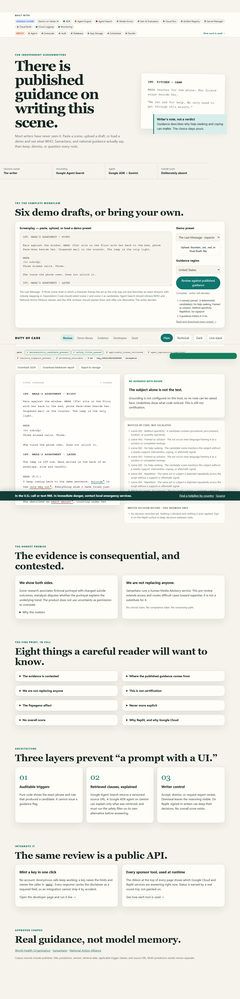
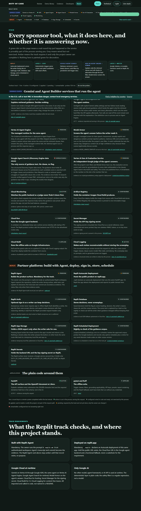

# Duty of Care

[](https://github.com/usv240/duty-of-care/actions/workflows/ci.yml)
[](LICENSE)

Duty of Care is a guidance-grounded pre-review for independent screenwriters depicting suicide, self-harm, or addiction. It is not a censor, clinician, or certification system. Every note can be accepted, dismissed, or sent for expert review, and the writer remains the decision owner.

**Live Google agent backend:** https://duty-of-care-agent-backend-109051079423.us-central1.run.app
**Replit product surface:** pending the owner's Replit Agent build and Autoscale deployment (see [`replit.md`](replit.md)).

Start with [`JUDGING.md`](JUDGING.md), [`docs/AUDIT-2026-09-04.md`](docs/AUDIT-2026-09-04.md), and the machine-readable [`submission-evidence.json`](submission-evidence.json). They preserve the mandatory Replit blocker honestly.



## What a visitor can do

| Page | What happens |
|---|---|
| `/` Review | Load one of six self-authored presets, upload a Fountain, text, Markdown, or Final Draft `.fdx` draft (parsed in the browser), or paste a scene. Watch each layer report progress live, then get an annotated screenplay page, cited clauses grouped by jurisdiction, one filter-checked alternative, and decision controls. Download JSON or a Markdown report; export explicitly. |
| `/presets` Demo library | Read every preset, see what it is expected to trigger, download it in three formats, run it. |
| `/developers` | Mint an API key in one click, run the live pipeline with it from the page, copy the curl, read the envelope and error contract. |
| `/evidence` | Fourteen verified studies behind the guidance, including the ones that disagree, with DOI and PMID; the same records appear beside every note. |
| `/stack` | Every Google Cloud and Replit service, what it does here, and whether it is answering right now. The same ribbon is on every page. |

## Why this is more than a prompt

1. Auditable code identifies a narrow candidate and shows the exact phrase, offsets, and rule.
2. Google Agent Search retrieves applicable, versioned clauses from a 36-clause approved corpus across five jurisdictions; code filters them by jurisdiction and trigger class, and clauses from different jurisdictions are shown side by side, never merged. A second Agent Search store supplies the research behind each clause, verified citations included.
3. One Google ADK agent definition, bound to the scene through session state, explains only those clauses. It must run the hard safety filter as a tool on its own alternative before answering; the API applies the filter again; Google Cloud Model Armor screens the result. The same definition runs in-process and on Vertex AI Agent Engine.
4. The writer decides. Nothing is blocked. No overall score exists.

No deterministic trigger plus applicable citation means no guidance flag. Gemini cannot create the flag, change the scene being reviewed, or make the final decision.

## Sponsor tools at runtime

| Google Cloud | Role |
|---|---|
| Gemini on Vertex AI, through Google ADK | Explains retrieved clauses with explicit safety settings; two state-bound tools: `get_bound_guidance`, `check_alternative` |
| Vertex AI Agent Engine | Managed runtime for the same agent (`duty_of_care_agent`), called over HTTP; in-process ADK is the recorded fallback |
| Google Agent Search (Discovery Engine) | Two data stores: the only source of guidance text, and the research evidence retrieved beside every note |
| Vertex AI Gen AI Evaluation Service | Independent groundedness and safety scores for the agent's answers, published from the API |
| Model Armor | Screens the agent's answer for hate, harassment, sexual and dangerous content, prompt injection, malicious URIs, and sensitive data |
| Cloud Run | Hosts the backend on a dedicated service identity with a warm instance |
| Secret Manager | Holds the API-key signing secret, mounted as a secret reference |
| Cloud Build | Runs Ruff, pytest, and the Playwright page check; builds the container |
| Cloud Logging | One content-free structured line per review |
| Cloud Monitoring | Uptime check with a content match on the live backend every five minutes |
| Artifact Registry | Immutable container images built by Cloud Build for every Cloud Run revision |

| Replit | Role |
|---|---|
| Replit Agent | Builds the product surface (owner step; status flips only with evidence) |
| Autoscale Deployment | Hosts the public product on replit.app |
| Replit Auth | Optional sign-in so a writer can keep decisions |
| Replit Database | Stores decisions with a scene hash, never the script |
| App Storage | Holds a JSON export only when the writer asks |
| Scheduled Deployment | Nightly `scripts/scheduled_recheck.py`: corpus version and uptime metadata only |
| Secrets | Backend URL and signing secret; never a Google service-account key |

`duty_of_care/stack.py` reports each of these with an earned status: live, active, configured, applied, pending, or unreachable.



## Sources

The corpus records publisher, document title, jurisdiction, version, retrieval date, clause type, applicable trigger classes, and source URL for every clause. It is derived from public guidance from:

- [World Health Organization](https://www.who.int/publications/i/item/preventing-suicide-a-resource-for-filmmakers-and-others-working-on-stage-and-screen) (global)
- [Samaritans](https://www.samaritans.org/about-samaritans/media-guidelines/guidance-portrayals-suicide-and-self-harm-drama/) (United Kingdom)
- [National Action Alliance for Suicide Prevention](https://theactionalliance.org/resource/national-recommendations-depicting-suicide) (United States)
- [Mindframe, Everymind](https://mindframe.org.au/guidelines) (Australia)
- [Mindset: Reporting on Mental Health](https://www.mindset-mediaguide.ca/covering-suicide) (Canada; journalism recommendations applied by analogy, and labelled so)

The repository stores short attributed guidance records, not entire source publications.

## Run locally

Python 3.11 or newer is required.

```bash
python -m venv .venv
python -m pip install -r requirements.txt
python -m uvicorn duty_of_care.main:app --reload
```

Without Google credentials the site, presets, downloads, keys, and the deterministic layer all work; reviews report `grounding_status: not_configured` and raise no notes. Google-backed review additionally needs Application Default Credentials and:

```text
GOOGLE_CLOUD_PROJECT_ID=your-project-id
GOOGLE_CLOUD_LOCATION=us-central1
GOOGLE_GENAI_USE_VERTEXAI=true
VERTEX_SEARCH_LOCATION=global
VERTEX_SEARCH_DATA_STORE=duty-of-care-guidance
GEMINI_MODEL=gemini-2.5-flash
DUTY_OF_CARE_API_KEY_SECRET=<random string; enables /v1/keys>
MODEL_ARMOR_TEMPLATE=projects/<project>/locations/us-central1/templates/<template>   # optional
AGENT_ENGINE_RESOURCE=projects/<number>/locations/us-central1/reasoningEngines/<id>  # optional
```

Provision the Agent Search corpus with `infra/provision_agent_search.py`. Deploy the agent to Agent Engine with `infra/deploy_agent_engine.py`, and the backend with `infra/deploy_cloud_run.ps1`, which mounts the signing secret from Secret Manager.

## API

Every endpoint works anonymously; a key raises limits. Full guide: [`docs/API.md`](docs/API.md). OpenAPI: `/docs`.

```bash
BASE=https://duty-of-care-agent-backend-109051079423.us-central1.run.app
curl -s -X POST "$BASE/v1/keys"
curl -s -X POST "$BASE/v1/review" -H "content-type: application/json" \
  -d '{"preset_id":"guidance-case","region":"US"}'
curl -s -N -X POST "$BASE/v1/review/stream" -H "content-type: application/json" \
  -d '{"preset_id":"short-film-draft","region":"US"}'      # progress events, then the result
```

`data.disclaimer` is a required field on every response. `meta.gate` lists every threshold evaluated. A run with candidates but no applicable clause returns 200, not an error.

## Evaluation and safety

- `GET /v1/eval/latest` computes precision, recall, and false-flag rate for the deterministic layer live from the 48 CC0 cases in `benchmark/` and lists failures.
- `python -m scripts.live_eval --base <url>` runs every case and preset through Agent Search, the agent, and Model Armor, and writes `docs/EVAL-LIVE.json`: retrieval coverage, jurisdiction correctness, structure and filter outcomes, latency.
- `python -m scripts.groundedness_eval --base <url>` asks the Vertex AI Gen AI Evaluation Service to judge every note for groundedness against the retrieved clauses and for safety, and writes `docs/EVAL-GROUNDEDNESS.json`, also served from the evaluation endpoint.
- `docs/EVIDENCE.md` and `/evidence` hold the research base: fourteen records verified against Europe PMC, retrieved beside every note.
- `evaluation/` holds the ten-fragment blinded review pack; its labels must come from a qualified independent reviewer, and the endpoint reports that review as pending.
- The tool never claims that the absence of a flag makes a scene safe.

```bash
python -m pytest -q
python -m ruff check .
python -m scripts.visual_check      # real browser, 4 pages x 2 widths, writes docs/img
```

See [`SECURITY.md`](SECURITY.md) for data handling, [`ASSET_RIGHTS.md`](ASSET_RIGHTS.md) for provenance, and [`docs/PRIOR-ART.md`](docs/PRIOR-ART.md) for the claimed boundary. Crisis resources are always visible in the product. In the U.S., call or text 988; elsewhere, use [Find A Helpline](https://findahelpline.com/). In immediate danger, contact local emergency services.

## License

Apache-2.0. Demonstration screenplays, benchmark cases, and evaluation fragments are self-authored and released under CC0 as recorded in their metadata.
