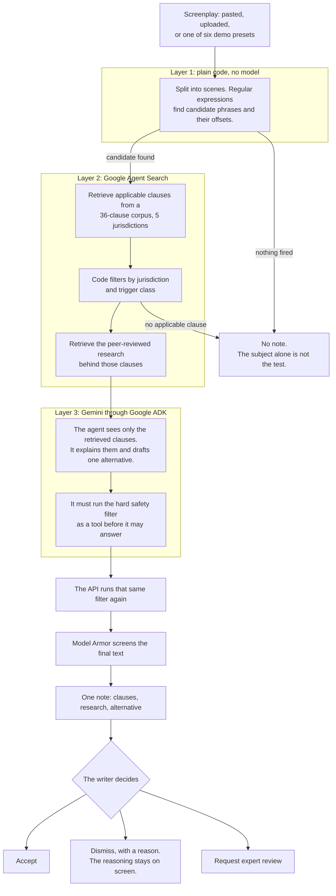

# Duty of Care

[](https://github.com/usv240/duty-of-care/actions/workflows/ci.yml)
[](LICENSE)

**Published guidance on depicting suicide, placed beside the scene, while the writer is still writing.**

A major studio can hire a consultant to check how a script depicts suicide. An
independent screenwriter cannot. The guidance those consultants use is public,
but it sits in long PDFs, split across countries. Duty of Care retrieves the
clause that actually applies to a scene, shows the research behind it, and offers
one alternative that keeps the drama.

It is not a censor, a clinician, or a certification system. There is no overall
score, nothing is ever blocked, and the writer keeps every decision.

> **The one idea:** it does not detect the topic. It detects when published
> guidance actually applies. No applicable citation means no note.

| | |
|---|---|
| **Try it (the hosted project)** | https://duty-of-care.replit.app |
| **Google agent backend** | https://duty-of-care-agent-backend-109051079423.us-central1.run.app |
| **Where to start reading** | [`JUDGING.md`](JUDGING.md), then [`docs/API.md`](docs/API.md) |


## How it works

Three layers. Each one can only do its own job, and the two that matter most are
plain code rather than a model.



Gemini cannot create a note, change the scene under review, or make the final
decision. It explains something that was already retrieved.

## What you can do on the site

| Page | What happens |
|---|---|
| `/` **Review** | Load one of six demo drafts, upload your own (Fountain, `.txt`, `.md`, or Final Draft `.fdx`, parsed in the browser), or paste a scene. Each layer reports progress as it runs. You get an annotated screenplay page, cited clauses grouped by jurisdiction, one filtered alternative, and decision controls. Download JSON or a Markdown report. |
| `/presets` **Demo library** | Read all six drafts, see what each is expected to trigger, download them, run them. |
| `/evidence` | The 14 studies behind the guidance with DOI and PMID, including the ones that disagree. |
| `/developers` **API** | Mint a key in one click and run the live pipeline from the page. |
| `/stack` | Every Google Cloud and Replit service, what it does here, and whether it answered your review just now. |

## The research behind the guidance

The tool does not assert these findings; it retrieves them beside the clause they
support, so a writer can judge the reasoning. All 14 records were verified against
Europe PMC, and the contested ones are shipped alongside the rest on purpose.

| Finding | Source |
|---|---|
| Reporting a suicide **method** was associated with a 30% increase in deaths by that method (RR 1.30, CI 1.18–1.44); celebrity reports with a 13% increase | Niederkrotenthaler et al., *BMJ* 2020, [10.1136/bmj.m575](https://doi.org/10.1136/bmj.m575) |
| In **fictional** portrayals, depictions of suicide death were associated with an 18% increase in suicides (RR 1.18, CI 1.09–1.27) | Niederkrotenthaler et al., *EClinicalMedicine* 2021, [10.1016/j.eclinm.2021.100922](https://doi.org/10.1016/j.eclinm.2021.100922) |
| The protective side: stories of people coming **through** a crisis are associated with fewer deaths (the Papageno effect) | Niederkrotenthaler et al., *British Journal of Psychiatry* 2010, [10.1192/bjp.bp.109.074633](https://doi.org/10.1192/bjp.bp.109.074633) |
| Across American feature films 1950–2002, each recovery-focused narrative predicted a lower national suicide rate | Stack et al., *Crisis* 2026, [10.1027/0227-5910/a001012](https://doi.org/10.1027/0227-5910/a001012) |
| *13 Reasons Why*: an increase in suicides among 10–17 year olds (IRR 1.29) | Bridge et al., *JAACAP* 2020, [10.1016/j.jaac.2019.04.020](https://doi.org/10.1016/j.jaac.2019.04.020) |
| **The study that disagrees:** a reanalysis found the increase was no greater than the month before release, and that harm cannot be attributed from aggregate rates | Romer, *PLOS ONE* 2020, [10.1371/journal.pone.0227545](https://doi.org/10.1371/journal.pone.0227545) |

All 14 records, with what each means for a writer: [`docs/EVIDENCE.md`](docs/EVIDENCE.md)
and [`guidance/evidence.json`](guidance/evidence.json).

## Where the guidance comes from

The corpus records publisher, document title, jurisdiction, version, retrieval
date, clause type, applicable trigger classes, and source URL for every clause.
Clauses from different jurisdictions are shown side by side, never merged.

- [World Health Organization](https://www.who.int/publications/i/item/preventing-suicide-a-resource-for-filmmakers-and-others-working-on-stage-and-screen) (global)
- [Samaritans](https://www.samaritans.org/about-samaritans/media-guidelines/guidance-portrayals-suicide-and-self-harm-drama/) (United Kingdom)
- [National Action Alliance for Suicide Prevention](https://theactionalliance.org/resource/national-recommendations-depicting-suicide) (United States)
- [Mindframe, Everymind](https://mindframe.org.au/guidelines) (Australia)
- [Mindset: Reporting on Mental Health](https://www.mindset-mediaguide.ca/covering-suicide) (Canada; journalism recommendations applied by analogy, and labelled as such)

The repository stores short attributed guidance records, not whole publications.

## Sponsor tools at runtime

`duty_of_care/stack.py` gives each service an earned status: live, active,
applied, configured, pending, or unreachable. A card only turns green when a real
call proves it, which is why two of them do not.

| Google Cloud | Role |
|---|---|
| Gemini on Vertex AI, via Google ADK | Explains retrieved clauses. Two state-bound tools: `get_bound_guidance`, `check_alternative` |
| Vertex AI Agent Engine | Managed runtime for the same agent (`duty_of_care_agent/`); in-process ADK is the recorded fallback |
| Google Agent Search (Discovery Engine) | Two data stores: the only source of guidance text, and of the research beside each note |
| Vertex AI Gen AI Evaluation Service | Independent groundedness and safety scores, published from the API |
| Model Armor | Screens the agent's answer for hate, harassment, sexual and dangerous content, prompt injection, malicious URIs, sensitive data |
| Cloud Run | Hosts the backend on a dedicated service identity |
| Secret Manager | Holds the API-key signing secret, mounted by reference |
| Cloud Build | Runs Ruff and the test suite; builds the container |
| Cloud Logging | One content-free structured line per review |
| Cloud Monitoring | Uptime check with a content match, every five minutes |
| Artifact Registry | Immutable images for every Cloud Run revision |

| Replit | Role |
|---|---|
| Replit Agent | Built the fixed-origin backend proxy ([`docs/REPLIT-BUILD-EVIDENCE.md`](docs/REPLIT-BUILD-EVIDENCE.md)) |
| Autoscale Deployment | Hosts the public product on replit.app |
| Replit Auth | Optional sign-in so a writer can keep decisions |
| Replit Database | Stores decisions with a scene hash, never the script |
| Replit Secrets | Backend URL and signing secret; never a Google service-account key |
| App Storage | Holds a JSON export only when the writer asks. **Reads `configured`: no bucket exists, so the write fails and the tool says so** |
| Scheduled Deployment | Nightly `scripts/scheduled_recheck.py`. **Reads `configured`: no schedule has run here** |


## Run it locally

Python 3.11 or newer.

```bash
python -m venv .venv
python -m pip install -r requirements.txt
python -m uvicorn duty_of_care.main:app --reload      # http://127.0.0.1:8000
```

**Without Google credentials** the site, presets, downloads, API keys, and the
deterministic layer all work. Reviews report `grounding_status: not_configured`
and raise no notes, because a note without a citation is not something this tool
will produce.

**With Google credentials**, set Application Default Credentials plus:

```text
GOOGLE_CLOUD_PROJECT_ID=your-project-id
GOOGLE_CLOUD_LOCATION=us-central1
GOOGLE_GENAI_USE_VERTEXAI=true
VERTEX_SEARCH_LOCATION=global
VERTEX_SEARCH_DATA_STORE=duty-of-care-guidance
VERTEX_SEARCH_EVIDENCE_STORE=duty-of-care-evidence
GEMINI_MODEL=gemini-2.5-flash
DUTY_OF_CARE_API_KEY_SECRET=<any random string; enables /v1/keys>
MODEL_ARMOR_TEMPLATE=projects/<project>/locations/us-central1/templates/<template>   # optional
AGENT_ENGINE_RESOURCE=projects/<number>/locations/us-central1/reasoningEngines/<id>  # optional
```

Provision the two Agent Search data stores with `infra/provision_agent_search.py`,
deploy the agent with `infra/deploy_agent_engine.py`, and the backend with
`infra/deploy_cloud_run.ps1`.

## Testing

No credentials or network are needed for the offline suite.

```bash
python -m pip install pytest==9.0.2 ruff==0.15.6      # the versions CI pins
python -m pytest -q                                    # 71 tests
python -m ruff check .
```

The browser check drives a real Chromium over five pages at two widths, asserting
no console errors and no horizontal overflow:

```bash
python -m playwright install chromium
python -m scripts.visual_check --no-shots     # drop the flag to rewrite docs/img
```

Two evaluations run against a deployed instance rather than a mock, so they need
a URL:

```bash
python -m scripts.live_eval --base <url>          # writes docs/EVAL-LIVE.json
python -m scripts.groundedness_eval --base <url>  # writes docs/EVAL-GROUNDEDNESS.json
```

GitHub Actions runs Ruff, the suite, the browser check, and a Docker build on
every push ([`.github/workflows/ci.yml`](.github/workflows/ci.yml)).

## What we measured

| Measure | Result | Where |
|---|---|---|
| Deterministic layer, 48 CC0 cases | Computed live, with failures listed | `GET /v1/eval/latest` |
| Live pipeline, 54 cases | 279 clauses retrieved, **0 outside the chosen jurisdiction**, every candidate scene grounded | [`docs/EVAL-LIVE.json`](docs/EVAL-LIVE.json) |
| **Independent judge** (Vertex AI Gen AI Evaluation Service) | **9 of 9 explanations fully grounded** in the retrieved clauses, the scene and the triggers (mean 1.0); 9 of 9 rated safe | [`docs/EVAL-GROUNDEDNESS.json`](docs/EVAL-GROUNDEDNESS.json) |
| Expert review of the blinded ten-fragment pack | **Pending.** Those labels are not ours to write | [`evaluation/`](evaluation/) |

The published groundedness file also records what the judge does *not* measure.

## API

Every endpoint works anonymously; a key raises the limits. Full guide:
[`docs/API.md`](docs/API.md). OpenAPI at `/docs`.

```bash
BASE=https://duty-of-care.replit.app

curl -s -X POST "$BASE/v1/keys" -H "content-type: application/json" -d '{}'

curl -s -X POST "$BASE/v1/review" -H "content-type: application/json" \
  -d '{"preset_id":"guidance-case","region":"US"}'

curl -s -N -X POST "$BASE/v1/review/stream" -H "content-type: application/json" \
  -d '{"preset_id":"short-film-draft","region":"US"}'   # progress events, then the result
```

`data.disclaimer` is required on every response and an integrator cannot strip it.
`meta.gate` names every threshold evaluated, passed and failed. A run with
candidates but no applicable clause returns 200 with no notes, not an error.

## Safety boundaries

- No overall score. A single rating invites optimising a script toward a number.
- No blocking path, and no wording that says a scene is safe. That phrasing is
  rejected in code.
- No model-recalled guidance or research. No citation, no note.
- No screenplay stored by default. Decisions are saved with a scene hash;
  exports are explicit and opt-in.

See [`SECURITY.md`](SECURITY.md) for data handling, [`ASSET_RIGHTS.md`](ASSET_RIGHTS.md)
for provenance, and [`docs/PRIOR-ART.md`](docs/PRIOR-ART.md) for what this does
and does not claim over existing work.

Crisis resources are visible on every page of the product. In the U.S., call or
text **988**. Elsewhere, [Find A Helpline](https://findahelpline.com/). In
immediate danger, contact local emergency services.

## License

Apache-2.0. The demonstration screenplays, benchmark cases, and evaluation
fragments are self-authored and released under CC0, as recorded in their metadata.
